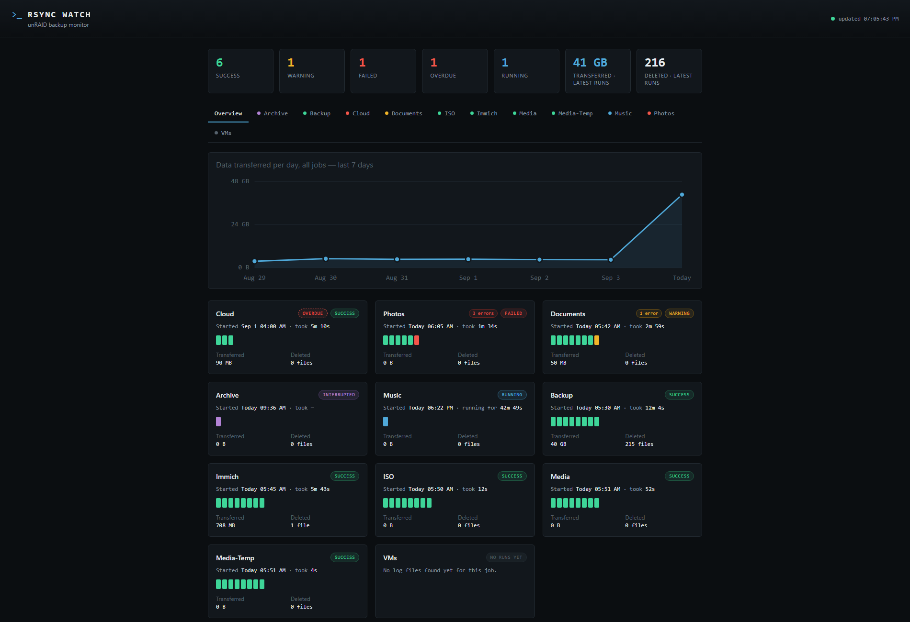
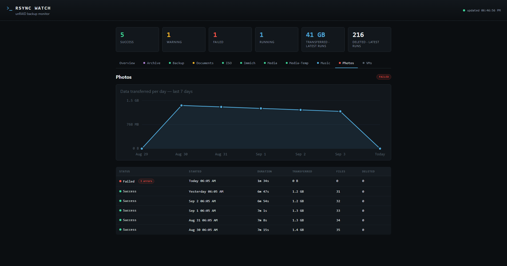

<p align="center"></p>

# Rsync Watch

A small read-only dashboard for your unRAID rsync backup jobs. It reads the log
files your scripts already write to `/mnt/user/appdata/rsync_logs/` and shows,
per job: last run status (success / warning / failed / running), start time,
duration, data transferred, and files deleted — plus a short history per job.

It does **not** touch your scripts and can't trigger backups. It only reads log
files, so there's very little that can go wrong.

## Screenshots

Overview — every job's latest status, transfer size, and a run-history strip at
a glance:



Per-job detail — the full run history with durations, sizes, and (for failed
runs) expandable error lines:



*(Sample data — the screenshots above are generated from anonymized example
logs, not a real backup target.)*

## How it works, in plain terms

- **`log_parser.py`** — opens each `.log` file your scripts already create and
  extracts the numbers rsync prints (`Number of deleted files:`, `Total
  transferred file size:`, etc.), plus the start/finish lines your scripts write.
- **`app.py`** — a small web server (Flask) that serves the dashboard page and
  a JSON API the page calls every 30 seconds.
- **`static/` + `templates/`** — the actual dashboard page (HTML/CSS/JS).
- **`Dockerfile`** — the recipe that packages all of the above, plus Python
  itself, into one self-contained image so it runs the same way anywhere.
- **`icon.svg` / `icon.png`** — the container icon (also used as the browser
  tab favicon).
- **`unraid-template.xml`** — lets you add the container from the unRAID GUI
  instead of typing every field by hand.
- **`examples/`** — anonymized copies of the backup scripts that produce the
  logs, so you can see the exact format the parser expects (see below).
- **`.github/workflows/build.yml`** — builds the image and publishes it to
  GitHub's container registry (ghcr.io) automatically, so unRAID only ever
  needs to *pull*, never build.

### How a run is classified

- **Success** — script's own exit code was `0` and no `rsync warning` appeared.
- **Warning** — exit code `0` with an rsync warning, exit code `24` ("some
  files vanished before they could be transferred" — routine when syncing a
  live filesystem), or (for your multi-folder scripts) some sub-folders
  succeeded and others failed.
- **Failed** — exit code was non-zero, or every sub-folder failed.
- **Running** — no completion line yet, and the log was touched in the last 6
  hours.
- **Interrupted** — no completion line, and it's older than 6 hours (the
  script likely crashed or the server restarted mid-run).

This is all inferred from the same text your backup scripts already produce —
you don't have to change how they run, only make sure their logs land under
`LOGS_ROOT/<server>/<category>/`.

## Example backup scripts

The [`examples/`](examples/) folder has two **anonymized** scripts showing the
log format the dashboard parses — copy them as a starting point and replace the
placeholders (`192.0.2.x` IPs, `BackupServer`, etc.) with your own:

- **[`examples/rsync-job.sh`](examples/rsync-job.sh)** — a single-target job.
  It writes `--- Starting rsync at ... ---` / `--- rsync finished ... with
  exit code N ---` markers plus rsync's `--stats` block, which is everything
  the parser needs for status, timing, and transfer sizes.
- **[`examples/backup-schedule.sh`](examples/backup-schedule.sh)** — a master
  wrapper that runs several jobs in sequence. Note its offline failsafe: if the
  remote is unreachable it writes a short "failed" log for each job, so a
  skipped night shows as **Failed** instead of the dashboard silently keeping
  the previous run's status.

> **Publishing your own?** This is a public repo. The scripts in `examples/`
> are scrubbed on purpose — real host IPs, SSH usernames, key paths, and
> machine/folder names are replaced with placeholders. If you contribute your
> own samples or logs, do the same before pushing.

## Deploying on unRAID — recommended: GitHub Actions + GHCR

This is the "edit on GitHub, update from the unRAID GUI" flow: no terminal on
unRAID, ever, after the one-time setup below.

### One-time setup

1. Push this folder to a GitHub repo (see the full walkthrough at the bottom
   if you haven't yet).
2. The workflow in `.github/workflows/build.yml` runs automatically on that
   push. Check the **Actions** tab on your repo — once it finishes (~1–2
   minutes), your image is published to GitHub's container registry.
3. Make the package pullable: go to your GitHub profile → **Packages** tab →
   `rsync-dashboard` → **Package settings** → **Change visibility** → Public.
   (Without this, unRAID can't pull it without extra credentials — see
   Troubleshooting if you'd rather keep it private.)
4. Edit `unraid-template.xml`: replace the two `YOUR-GITHUB-USERNAME`
   placeholders and the `YOUR-REPO-NAME` placeholder with your actual GitHub
   username/repo, then push that change too.
5. Copy `unraid-template.xml` to unRAID's flash drive, once, via Terminal:
   ```bash
   mkdir -p /boot/config/plugins/dockerMan/templates-user
   curl -o /boot/config/plugins/dockerMan/templates-user/rsync-dashboard.xml \
     https://raw.githubusercontent.com/g-guglielmi/rsync-dashboard/main/unraid-template.xml
   ```

### Add the container

Docker tab → **Add Container** → **Template** dropdown (top of the page) →
pick **rsync-dashboard** → everything fills in → **Apply**. unRAID pulls the
image from ghcr.io directly; nothing is built on the server.

Open `http://<your-unraid-ip>:8686`.

### Updating from here on

```
edit code  →  git commit  →  git push
```
GitHub Actions rebuilds and republishes `:latest` automatically. In the
unRAID GUI, click the container's icon → **Force Update** (or use unRAID's
"check for updates" if you have that enabled) to pull the new image. No
terminal, no local build.

## Releases

Every push to `main` updates the rolling `:latest` tag. When you want to mark
a version as a proper checkpoint — say, after testing a change you're happy
with — tag it:

```bash
git tag v1.1.0
git push origin v1.1.0
```

That triggers the workflow to also publish `:v1.1.0` (and `:v1.1`, `:v1`), and
creates a **GitHub Release** on the repo's Releases page with auto-generated
notes listing what changed since the last tag. Two things that gets you:

- **A changelog** — the Releases page becomes a running history of what
  shipped and when, without you writing anything by hand.
- **The ability to pin a known-good version** — instead of tracking `:latest`,
  set the template's Repository field to a specific tag, e.g.
  `ghcr.io/you/rsync-dashboard:v1.1.0`. If a later change breaks something,
  you can point it back at an older tag and Force Update to roll back
  instantly, without touching git.

Version numbers are just a convention (`vMAJOR.MINOR.PATCH`) — bump the last
number for small fixes, the middle for new features, the first for anything
that changes how it's configured.

## Alternative: build locally (skip GitHub Actions entirely)

If you'd rather not publish a package at all — even privately — you can still
build on the unRAID server itself and skip GHCR completely:

```bash
git clone https://github.com/g-guglielmi/rsync-dashboard.git \
  /mnt/user/appdata/rsync-dashboard-src
cd /mnt/user/appdata/rsync-dashboard-src
docker build -t rsync-dashboard .
```

Then in `unraid-template.xml`, change the `<Repository>` value back to
`rsync-dashboard` (no `ghcr.io/...` prefix) before adding the container via
the GUI. Updating then means `git pull && docker build ...` again, followed
by Force Update in the GUI.

## Running outside unRAID (plain `docker run`)

On any other Docker host (e.g. managed with Dockhand), the equivalent of the
unRAID template is:

```bash
docker run -d \
  --name rsync-dashboard \
  -p 8686:8686 \
  -v /path/to/rsync_logs:/data/logs:ro \
  -e TZ=Europe/Rome \
  --restart unless-stopped \
  ghcr.io/g-guglielmi/rsync-dashboard:latest
```

## Running the tests

The log parser has a pytest suite. To run it locally:

```bash
python -m venv .venv && . .venv/bin/activate   # .venv\Scripts\activate on Windows
pip install -r requirements-dev.txt
pytest
```

## A note on privacy

This is a public repo. The backup scripts themselves are **not** included here
on purpose — they contain host IPs, SSH usernames, key paths, and machine
names. If you ever add real log samples or scripts (e.g. an `examples/` folder
to illustrate the log format), scrub those details first: replace real
hostnames, usernames, folder names, and IPs with generic placeholders
(`vm-one`, `backup-user`, `folder-a`, etc.), as the test fixtures in
`tests/` already do.

## Alerts (optional)

The dashboard can notify you — via **Telegram**, **Discord** and/or **e-mail**,
each independently optional — when something needs attention. Its unique
value is the **Overdue** check: a backup script that never ran (server was
off, scheduler hiccup, remote unreachable) can't report anything, so only
something watching the logs can notice the run is *missing*.

What it alerts on (`ALERT_EVENTS`, default `overdue,interrupted`):

- **overdue** — no run within the expected interval. `OVERDUE_HOURS` (default
  `26`: daily jobs plus a 2-hour grace) applies to every job; override single
  jobs with `JOB_INTERVALS`, e.g. `unRAID-4Bay/Docker=168; unRAID-4Bay/Scratch=0`
  (weekly job; `0` = never mark that one overdue).
- **interrupted** — a run that never finished (script crashed / server rebooted).
- **failed** / **warning** — off by default because the backup scripts already
  send their own notifications for those; add them if yours don't.

Each condition is alerted **once**, then a **recovery** message follows when it
clears (`ALERT_RECOVERY=false` to disable). The check runs every
`ALERT_CHECK_MINUTES` (default `5`). The Overdue badge and counter in the UI
work even with no channel configured.

Channels — set the variables for the ones you use (all in the unRAID template
under *Show more settings*):

| Channel | Variables |
|---|---|
| Telegram | `TELEGRAM_BOT_TOKEN`, `TELEGRAM_CHAT_ID`, optional `TELEGRAM_THREAD_ID` (forum topic) |
| Discord | `DISCORD_WEBHOOK_URL` |
| E-mail | `SMTP_HOST`, `SMTP_TO`; optional `SMTP_PORT` (587 STARTTLS / 465 SSL), `SMTP_USER`, `SMTP_PASSWORD`, `SMTP_FROM`, `SMTP_TLS` (`starttls`/`ssl`/`none`) |

Optional extras: `DASHBOARD_URL` (link appended to every message) and
`STATE_DIR` (default `/data/state`; mount it so already-sent alerts are
remembered across container updates — the template maps it to
`/mnt/user/appdata/rsync-dashboard`).

Handy endpoints once configured:

- `http://<ip>:8686/api/alerts/test` — sends a test message to every channel
  and reports per-channel success/failure.
- `http://<ip>:8686/api/alerts` — shows the effective config (no secrets) and
  which conditions are currently active.
- `http://<ip>:8686/api/alerts/check` — runs an evaluation right now.

## Troubleshooting

- **"Can't see /data/logs"** on the dashboard — the volume mount is missing or
  points at the wrong folder. Check the Path field matches where
  `LOG_DIR="/mnt/user/appdata/rsync_logs/..."` actually writes on your system.
- **Jobs show up but with no runs** — the folder exists but has no `.log`
  files yet, or they're older than 7 days (your scripts self-delete logs older
  than 7 days).
- **Times look off by a few hours** — double check the `TZ` variable matches
  your unRAID server's timezone.
- **unRAID can't pull the image / "unauthorized"** — the GHCR package is
  still private. Either make it public (see step 3 above), or run
  `docker login ghcr.io` once in the unRAID terminal with a GitHub personal
  access token that has `read:packages` scope, which lets unRAID pull private
  images too.
- **Icon doesn't show up** — same root cause as above if the repo/package is
  private; GitHub blocks unauthenticated access to files in private repos.
  Either make things public, or leave the Icon field blank — everything else
  works either way.
- **A new push didn't update the dashboard** — check the Actions tab for a
  failed build first, then confirm you clicked Force Update in unRAID (it
  doesn't happen automatically unless you've enabled unRAID's own
  update-checking).

## Configuration reference

Environment variables (all optional beyond what the template already sets):

| Variable | Default | What it does |
|---|---|---|
| `LOGS_ROOT` | `/data/logs` | Where *inside the container* logs are expected. Only change this if you also change the container-side path in the volume mapping. |
| `HISTORY_LIMIT` | `15` | How many past runs to keep per job. |
| `CACHE_SECONDS` | `20` | How long the server caches parsed results before re-reading log files. |
| `OVERDUE_HOURS` | `26` | Hours since the last run after which a job is marked **Overdue**. |
| `JOB_INTERVALS` | *(empty)* | Per-job overrides, `server/category=hours; …` (`0` disables). |
| `ALERT_EVENTS` | `overdue,interrupted` | Which conditions notify; may add `failed`, `warning`. |
| `ALERT_CHECK_MINUTES` | `5` | How often the alert checker runs. |
| `ALERT_RECOVERY` | `true` | Send a message when an alerted condition clears. |
| `STATE_DIR` | `/data/state` | Where sent-alert state is persisted. |
| `DASHBOARD_URL` | *(empty)* | Link appended to alert messages. |
| `TELEGRAM_*`, `DISCORD_WEBHOOK_URL`, `SMTP_*` | *(empty)* | Notification channels — see **Alerts**. |

---

## From this zip to a running dashboard: the full path

1. **Unzip** the download on your own computer.
2. **Create the GitHub repo**: on github.com, "New repository" → give it a
   name → leave "Initialize with README" **unchecked** (this folder already
   has one) → Create.
3. **Push this folder to it**, from inside the unzipped folder on your
   computer:
   ```bash
   git init
   git add .
   git commit -m "Initial version of rsync dashboard"
   git remote add origin https://github.com/g-guglielmi/rsync-dashboard.git
   git branch -M main
   git push -u origin main
   ```
4. **Wait for the Actions tab** on GitHub to finish building (~1–2 minutes),
   then make the package public — "One-time setup" step 3 above.
5. **Fix the placeholders** in `unraid-template.xml` (username + repo name),
   commit, push.
6. **Copy the template onto unRAID's flash drive** — step 5 above (one
   `curl` command in the unRAID terminal, only ever needed once).
7. **Add the container** from the unRAID GUI using the template.
8. **Open the dashboard** at `http://<your-unraid-ip>:8686`.

From here: edit code, commit, push, Force Update in the GUI. Tag a version
with `git tag vX.Y.Z && git push origin vX.Y.Z` whenever you want it marked
as a release with its own changelog entry and pinnable image tag.

## License

This project is released under the [MIT License](LICENSE).
